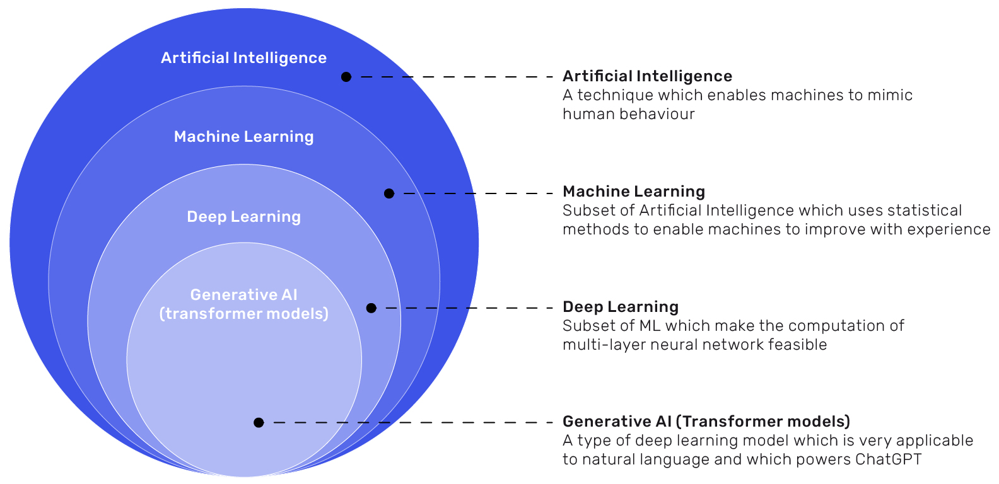
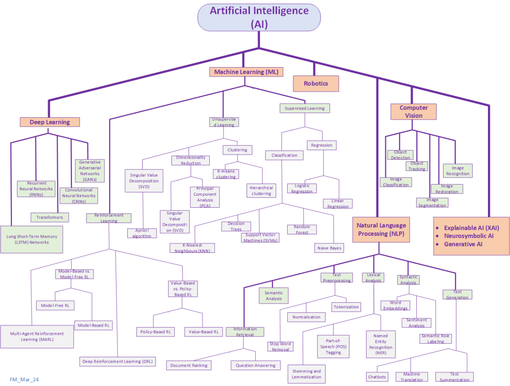
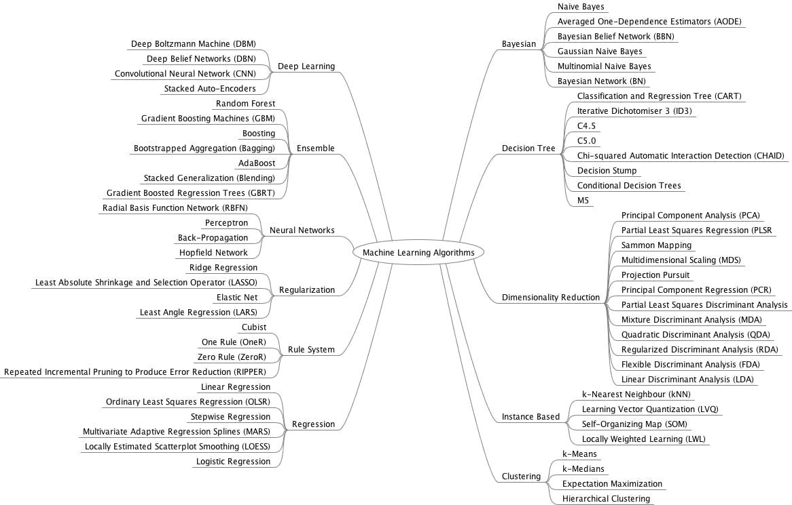

# Shortcut Resources

### 1️⃣ Overview — The AI → ML → DL → GenAI Hierarchy

> **Artificial Intelligence (AI)** is the broad concept of making machines mimic human thinking.
> **Machine Learning (ML)** uses data to let machines learn automatically.
> **Deep Learning (DL)** uses multi-layer neural networks for complex tasks.
> **Generative AI (GenAI)** uses transformer models to *create* — text, images, code, etc.

---

### 2️⃣ Learning Roadmap (Visual Mindmaps)

These diagrams summarize **AI domains** and **ML algorithms** visually — no need for heavy text.
They cover the relationships between ML, DL, NLP, CV, and Reinforcement Learning.

---

### 3️⃣ 📚 Learning Resources & Playlists

#### 🐍 Cheatsheets

* **Python Cheatsheet** → [CodeWithMosh PDF](https://cdn.codewithmosh.com/image/upload/v1702942822/cheat-sheets/python.pdf)
* **AI/ML Cheatsheet** → [GitHub: AI-ML Cheatsheets](https://github.com/SamBelkacem/AI-ML-cheatsheets)

#### ▶️ YouTube Playlists

* **PyTorch Crash Course** → [Learn PyTorch - FreeCodeCamp](https://youtube.com/playlist?list=PLqnslRFeH2UrcDBWF5mfPGpqQDSta6VK4&si=USdtkgsfxNBYnT7l)
* **Visual Intuition (3Blue1Brown)** → [YouTube Channel](https://www.youtube.com/@3blue1brown)
* **AI Concepts in 100 Seconds (Fireship)** → [Fireship AI Overview](https://youtu.be/PeMlggyqz0Y?si=hmqLnTuODFcH0Qm5)
* **5 PyTorch Projects (Hands-on)** → [Projects Video](https://youtu.be/E0bwEAWmVEM?si=oq4l-Tjz23jeOogN)
* **Reinforcement Learning (Practical)** → [Code Implementation](https://youtu.be/Mut_u40Sqz4?si=DZ2tJWkEOqEIGAEf)
* **Reinforcement Learning (Theory)** → [Concept Walkthrough](https://youtu.be/VnpRp7ZglfA?si=dC0G-jw5_zsjgGOP)

---

### 4️⃣ 🧩 Core Machine Learning Algorithm Families

| **Category**                        | **Quick Understanding (Interview-Style)**                                                 |
| ----------------------------------- | ----------------------------------------------------------------------------------------- |
| **Regression**                      | Predicts continuous values — e.g., house price, temperature.                              |
| **Classification / Decision Trees** | Categorizes things into groups using yes/no questions (e.g., is it spam?).                |
| **Clustering**                      | Groups similar data points automatically (e.g., customer segmentation).                   |
| **Bayesian Models**                 | Make predictions using probability and prior knowledge (like reasoning with uncertainty). |
| **Rule-Based Systems**              | Use predefined “if-then” logic — simple, interpretable, and fast.                         |
| **Regularization Methods**          | Prevent overfitting — helps models generalize better to new data.                         |
| **Dimensionality Reduction**        | Simplifies data by reducing features (like PCA) to focus on what matters most.            |
| **Ensemble Methods**                | Combine multiple models (e.g., Random Forest, Boosting) to improve accuracy.              |
| **Neural Networks**                 | Layers of artificial neurons — core of Deep Learning for vision, NLP, etc.                |
| **Instance-Based**                  | Store past examples and compare new data to them (like KNN).                              |

---
