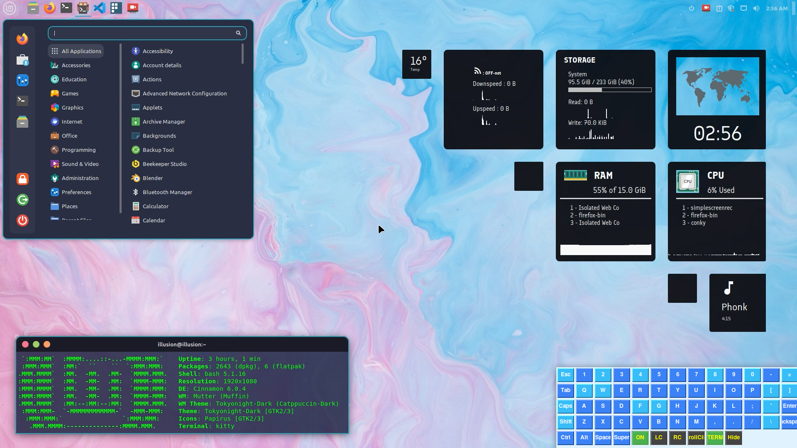

# Desktop Customization

This guide focuses on improving your Mint desktop aesthetics with themes, Conky system widgets, and other UI customizations.

---

## 🖼️ Current Theme Preview

### Screenshot




### Cinnamon Theme Settings
```bib
# Theme Configuration (Prathamesh Jakkula)
Mouse Pointer: Bibata-Modern-Classic
Applications: Tokyonight-Dark
Icons: Papirus
Desktop: Tokyonight-Dark
````

*(You can copy this configuration into your “Themes” settings in Cinnamon to replicate the same look.)*

---

## 🪞 Conky Customization (Sirius Theme)

A personalized Conky setup by **Prathamesh Jakkula**, built on top of the **Sirius Theme**.
It displays live system info such as CPU, RAM, network, and clock widgets.

### 📦 Source Repository

👉 [Prathamesh01110/configs](https://github.com/Prathamesh01110/configs)

---

### 🔧 Install Conky Manager 2

```bash
sudo add-apt-repository ppa:ubuntuhandbook1/conkymanager2
sudo apt update
sudo apt install conky-manager2 -y
```

---

### 🎨 Import and Apply Sirius Theme

1. Open **Conky Manager 2**
2. Click **Import Theme Pack**
3. Select the **Sirius Theme .zip**
4. Apply and enable desired widgets
5. Customize colors and layout as you prefer

---

## 🌈 Cinnamon Theme Customization

### Download New Themes

Visit [Cinnamon Look](https://www.gnome-look.org/p/1681315) to find community-created Mint themes.
download Tokyonight-B-MB-dark.tar.xz

### Apply a Theme

1. Extract the downloaded file.
2. Move the parent folder (contains `gtk-4.0`) into:

   ```bash
   ~/.themes
   ```
3. Go to:

   ```
   System Settings → Themes → Advanced Settings
   ```
4. Apply the theme to **Application** and **Desktop** sections.

---

## 🧩 Recommended Visual Enhancements

* Enable **Dark Mode**
* Adjust **Panel Opacity** under “Themes → Panel”
* Use **Conky Auto-Start** via Startup Applications for persistent widgets

---

✅ Tested on **Linux Mint (Cinnamon Edition)**
🎨 Theme Base: *Closebox73’s Sirius*
🔧 Customization: *Prathamesh Jakkula*

